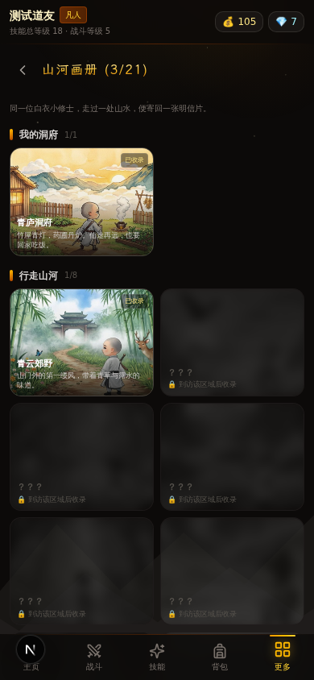

# 仙途挂机 · 文字放置修仙

> 一款 Harpagia 式的**文字放置修仙 RPG**，移动端优先的纯前端网页游戏。
> 修仙之路，闭关亦有所得 —— 真实离线进度，关掉浏览器也在变强。


## ✨ 特性

- **16 项技能，上限 200 级** — 5 项战斗系（气血 / 神兵 / 神力 / 御体 / 遁速）+ 11 项生活系（采矿 / 垂钓 / 炼丹 / 化缘 / 锻造 / 悟道 / 定力 / 气运 / 灵酒 / 灵识 / 寻宝），Harpagia 式 XP 曲线（15×L^2.5）
- **10 大区域 · 130 种妖兽** — 从青云郊野到上古仙墟（归墟海 / 仙墟两大晚末期地图），含 10 位区域妖王；回合制文字战斗，带暴击 / 闪避 / 速度判定
- **灵宠养成 · 进化与融合** — 战胜妖兽小概率收服为灵宠，出战提供属性加成并随战斗成长；等级达标后可消耗金币与妖丹**进化**（凡兽 → 灵兽 → 仙兽 → 神兽，属性最高 ×3.2），吞噬同种妖兽**融合升星**（上限五星，每星全属性 +6%）
- **炼器强化** — 背包内炼化装备：主属性 +12%/级、副词条 +6%/级，上限 +10；成功率逐级下降，失败仅折损材料、装备无损
- **宗门系统** — 拜入青云剑宗 / 丹霞谷 / 万兽门 / 万宝楼四大宗门（各配专属手绘画卷 banner），各享专属异能（经验 / 离线效率 / 灵宠加成 / 金币收益）；战斗积累贡献，兑换宗门商店珍品、晋升外门 → 内门 → 真传弟子，同门贡献榜实时排名
- **炼宝坊 · 专属神装** — 集齐妖王掉落的专属异宝（沧海鲛珠 / 仙帝残玉 / 渊主逆鳞 / 仙骸残片），炼制四大专属神装：渊主鳞铠·玄鳞不侵 / 仙骸残剑·大道剑鸣 / 沧海珠链·沧海无波 / 葬天玉玺·镇压气运；每件必带金色专属词条，随炼器等级继续成长
- **世界 BOSS · 伤害榜** — 10 位轮换巨兽（噬山血蟒 → 葬天仙帝），血量跨挑战持久，按伤害结算奖励；本期伤害与 12 位同服修士同榜竞逐，击杀必得仙品装备与大量宝石，归墟鲸祖 / 葬天仙帝更必掉专属异宝
- **轮回转生** — 战斗总等级达渡劫（750）后可转生：重置技能换取转生点数，每点永久 +1% 技能经验、+0.5% 攻血；金币、装备、灵宠、成就等资产全部保留，支持多世叠加
- **山河画册 · 集齐奖励** — 33 张手绘水彩明信片（含十大妖王专属画境），旅行青蛙式收录玩法；集齐各分页与整本画册可领宝石与**限定称号**（山河行者 / 百艺修士 / 画圣·山河印心）
- **境界换装** — 主页小修士形象随境界更换服饰：凡俗布衣 → 练气青衫 → 筑基云袍 → 金丹金纹 → 元婴紫金 → 化神星袍 → 渡劫赤金 → 飞升仙衣，8 套 AI 绘制立绘
- **限定称号收集** — 十大妖王各掉一枚猎神限定称号，集齐十枚现世隐藏称号「号令天下」；画册集齐 / 弟子位阶 / 转生轮回均可获得称号，主页一键佩戴切换
- **天梯榜** — 综合实力评分排名（含炼器、灵宠进化、转生加成），与 30 位 NPC 修士同榜争锋
- **真实离线进度** — 基于 `lastTick` 时间戳结算：离线修炼、离线战斗、离线采集一应俱全；**定力**技能与丹霞谷异能提升离线效率与时长上限
- **随机词条装备** — 6 大品质 × 主属性 + 0~4 条随机副词条，每件装备都是独一无二的
- **怪物卡收集** — 击败妖兽概率掉落卡牌，收录图鉴；130 只妖兽全部配有 AI 手绘水彩立绘卡，妖王金框徽章、未收集仅显示暗影剪影
- **仙市交易** — 购买丹药、材料与装备宝袋
- **炼丹与锻造** — 生活技能产出丹药与装备，反哺战斗成长
- **50+ 项成就 + 宝石系统** — 每级技能 +1 宝石，成就、图鉴、画册也能赚宝石
- **仙侠水墨风界面** — 黛青墨蓝玄夜主题 + 鎏金点缀、远山剪影氛围背景、金色渐变标题、进度条流光、战斗受击抖动 / 红闪反馈、HP 动态变色等细腻打磨；支持社交分享 OG 卡片（微信 / Twitter / Discord 链接预览）
- **移动端适配** — 底部 5 Tab 导航、44px 触摸目标、`safe-area` 刘海屏适配、桌面端自动居中

| 主页 · 此刻行踪 | 战斗 · 此刻所在 | 山河画册 | 桌面端 |
| --- | --- | --- | --- |
|  |  |  |  |

## 🎮 玩法速览

1. **战斗系技能**只能通过战斗提升，每场战斗五行技能互有涨落；
2. **生活系技能**在「技能」页选择活动修炼，主页能看到小修士正在做什么；
3. 战胜妖兽小概率**收服灵宠**，出战可提升属性，放生可换取金币；
4. 挑战**世界 BOSS** 按伤害拿奖励，打空血量必得仙品装备；
5. 技能每升 1 级送 1 颗宝石，成就与寻宝也能赚宝石，宝石可强化全技能；
6. 装备词条完全随机，气运越高掉落越好；
7. 每到一个新区域、修炼一项新活动、击败一位世界妖王，都会在「山河画册」收录一张明信片，共 33 张。

存档自动保存在浏览器 `localStorage`（键 `xiantu-idle-save-v1`），无需注册登录。

## 🚀 本地运行

```bash
# 安装依赖（bun / pnpm / npm 均可）
bun install

# 开发模式
bun run dev        # http://localhost:3000

# 生产构建
bun run build && bun start
```

> 纯前端单机游戏，无需数据库与环境变量 —— Prisma / auth 等脚手架文件未在游戏中使用。

## 🛠 技术栈

- **Next.js 16** (App Router) · **React 19** · **TypeScript 5**
- **Tailwind CSS 4** + shadcn/ui 组件
- **Zustand**（`persist` 中间件管理 localStorage 存档）
- 纯函数游戏引擎（`src/lib/game/engine.ts`），状态与视图完全解耦

## 📁 项目结构

```
src/
├── app/page.tsx              # 游戏入口
├── types/game.ts             # 全部类型定义
├── lib/game/
│   ├── monsters.ts           # 静态数据：10 区域/130 妖兽/区域妖王
│   ├── engine.ts             # 纯函数游戏引擎（战斗/修炼/掉落/离线结算）
│   ├── skills.ts             # 16 技能与 XP 曲线
│   ├── pets.ts               # 灵宠：捕获/成长/进化/融合
│   ├── items.ts              # 装备词条与品质（含专属词条注入）
│   ├── forge.ts              # 炼宝坊：四大专属神装配方与词条池
│   ├── worldboss.ts          # 世界 BOSS：10 妖轮换/挑战模拟/伤害奖励
│   ├── titles.ts             # 称号：妖王猎神 + 隐藏「号令天下」
│   ├── scenes.ts             # 山河画册：33 张场景明信片与解锁逻辑
│   ├── sects.ts / refine.ts / rebirth.ts  # 宗门/炼器/转生
│   ├── leaderboard.ts        # 天梯榜：实力评分/NPC 修士
│   └── achievements.ts       # 成就定义与检测
├── store/game.ts             # Zustand 全局状态 + persist 存档
├── hooks/useGameTick.ts      # 游戏主循环 tick
└── components/game/          # 游戏面板组件（底部 Tab 导航 + 更多子面板）

public/
├── monsters/                 # 130 只妖兽图鉴立绘（水彩绘本风）
├── scenes/                   # 山河画册场景与妖王画境
├── sects/                    # 四大宗门专属画卷 banner
├── avatars/                  # 境界换装立绘
└── og-cover.jpg              # 社交分享卡片（1200×630）

scripts/                      # AI 图像批量生成与压缩脚本
```

## 📜 License

MIT
