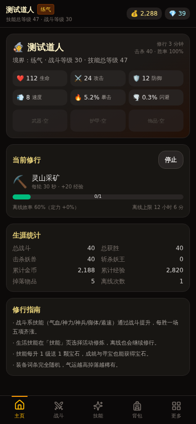
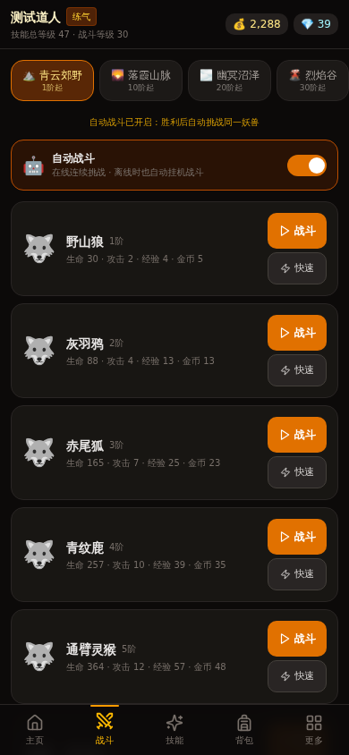
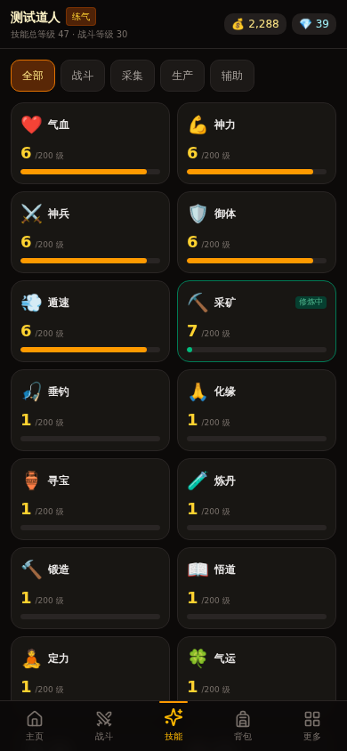
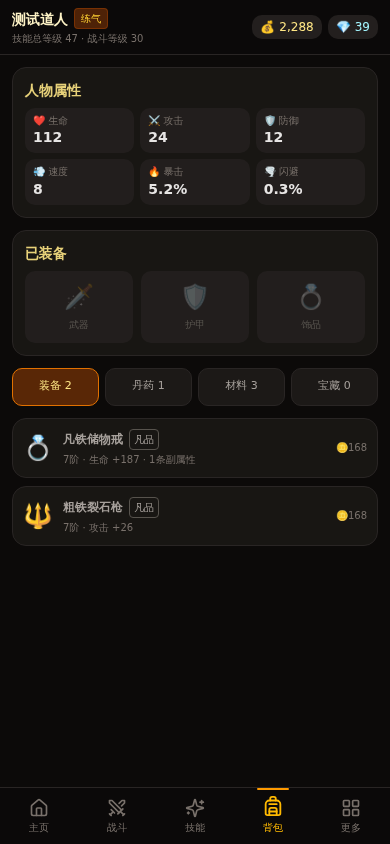

# 仙途挂机 · 文字放置修仙

> 一款 Harpagia 式的**文字放置修仙 RPG**，移动端优先的纯前端网页游戏。
> 修仙之路，闭关亦有所得 —— 真实离线进度，关掉浏览器也在变强。



## ✨ 特性

- **16 项技能，上限 200 级** — 5 项战斗系（气血 / 神兵 / 神力 / 御体 / 遁速）+ 11 项生活系（采矿 / 垂钓 / 炼丹 / 化缘 / 锻造 / 悟道 / 定力 / 气运 / 灵酒 / 灵识 / 寻宝），Harpagia 式 XP 曲线（15×L^2.5）
- **8 大区域 · 104 种妖兽** — 从青云山到九幽深渊，含 8 位区域妖王；回合制文字战斗，带暴击 / 闪避 / 速度判定
- **真实离线进度** — 基于 `lastTick` 时间戳结算：离线修炼、离线战斗、离线采集一应俱全；**定力**技能提升离线效率（60% → 100%）与离线时长上限（12h → 32h）
- **随机词条装备** — 6 大品质 × 主属性 + 0~4 条随机副词条，每件装备都是独一无二的
- **怪物卡收集** — 击败妖兽概率掉落卡牌，收录图鉴
- **仙市交易** — NPC 商人动态定价，低买高卖赚差价
- **炼丹与锻造** — 生活技能产出丹药与装备，反哺战斗成长
- **34 项成就 + 宝石系统** — 每级技能 +1 宝石，成就与图鉴也能赚宝石
- **移动端适配** — 底部 5 Tab 导航、44px 触摸目标、`safe-area` 刘海屏适配、桌面端自动居中

| 战斗 | 技能 | 背包 | 桌面端 |
| --- | --- | --- | --- |
|  |  |  |  |

## 🎮 玩法速览

1. **战斗系技能**只能通过战斗提升，每场战斗五行技能互有涨落；
2. **生活系技能**在「技能」页选择活动修炼，修炼也会继续涨修为；
3. 技能每升 1 级送 1 颗宝石，成就与寻宝也能赚宝石，宝石可强化全技能；
4. 装备词条完全随机，气运越高掉落越好。

存档自动保存在浏览器 `localStorage`（键 `xiantu-idle-save-v1`），无需注册登录。

## 🚀 本地运行

```bash
# 安装依赖（bun / pnpm / npm 均可）
bun install

# 开发模式
bun run dev        # http://localhost:3000

# 生产构建
bun run build && bun start
```

> 纯前端单机游戏，无需数据库与环境变量 —— Prisma / auth 等脚手架文件未在游戏中使用。

## 🛠 技术栈

- **Next.js 16** (App Router) · **React 19** · **TypeScript 5**
- **Tailwind CSS 4** + shadcn/ui 组件
- **Zustand**（`persist` 中间件管理 localStorage 存档）
- 纯函数游戏引擎（`src/lib/game/engine.ts`），状态与视图完全解耦

## 📁 项目结构

```
src/
├── app/page.tsx              # 游戏入口
├── types/game.ts             # 全部类型定义
├── lib/game/
│   ├── data.ts               # 静态数据：区域/怪物/物品/配方
│   ├── engine.ts             # 纯函数游戏引擎（战斗/修炼/掉落/离线结算）
│   ├── achievements.ts       # 成就定义与检测
│   ├── items.ts              # 装备词条与品质
│   └── skills.ts             # 16 技能与 XP 曲线
├── store/game.ts             # Zustand 全局状态 + persist 存档
├── hooks/useGameTick.ts      # 游戏主循环 tick
└── components/game/          # 9 个游戏面板组件（底部 Tab 导航）
```

## 📜 License

MIT
